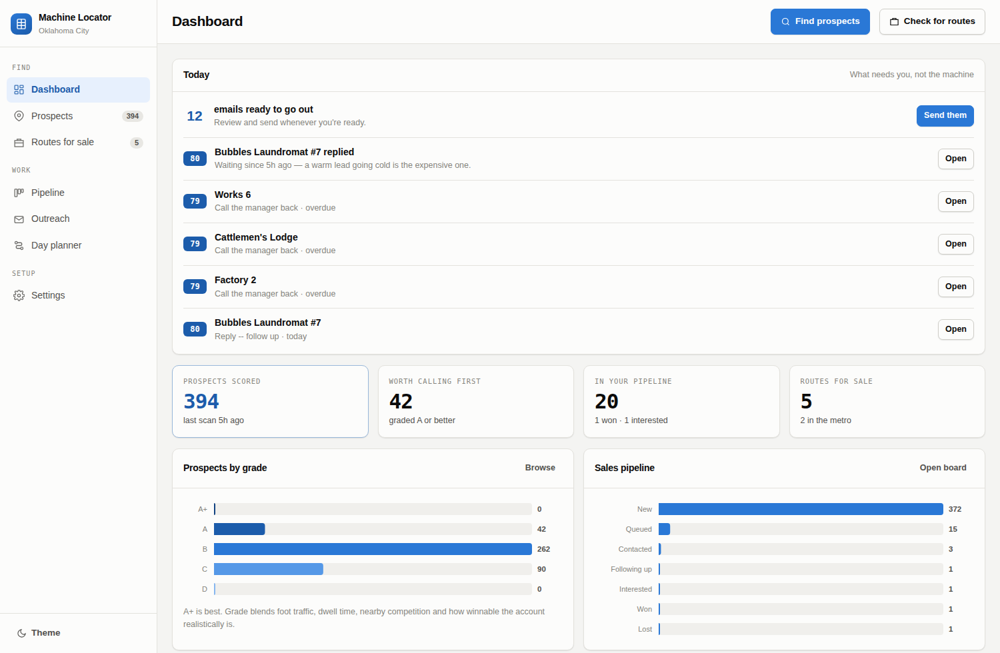

# Machine Locator

A desktop web app for running a vending route in the Oklahoma City metro. It does
three jobs:

1. **Finds places to put machines.** Pulls every plausible host site in the metro
   from OpenStreetMap, scores each one on how likely it is to pay for itself, and
   hands you a ranked call list on a map.
2. **Runs your outreach for you.** Pick prospects, hit one button, and each gets a
   personalised three-email sequence with follow-ups scheduled and replies handled.
3. **Watches for routes for sale.** Polls the business-for-sale marketplaces and
   flags the listings that are genuinely local vending routes.

**To run it: download this folder and double-click the launcher.**

| Your computer | Double-click |
|---|---|
| Mac | `Machine Locator.command` |
| Windows | `Machine Locator.bat` |
| Linux | `Machine Locator.command` (choose "Run in Terminal") |

The first run takes about a minute while it sets itself up. After that it opens
in a couple of seconds, straight into your browser. Nothing is installed outside
this folder — delete the folder and it's gone.

**[Try the interactive preview →](https://claude.ai/code/artifact/81ee93e6-7bbf-4be9-a171-daa503774da4)**
— the real interface running on sample data, so you can click around from any
device before you download anything.



---

## Install

Double-click the launcher for your system (above) and you're done — it sets up
everything it needs on first run.

**If the launcher won't start**, it's almost always because Python isn't
installed. The launcher says so and offers to open the download page; grab it
from [python.org/downloads](https://www.python.org/downloads/) (on Windows, tick
*"Add Python to PATH"* in the installer), then double-click the launcher again.

**If you'd rather use a terminal:**

```bash
python3 -m venv .venv && source .venv/bin/activate
pip install -e .
mloc app
```

Python 3.9+. No API keys are needed to find prospects — the location data comes
from OpenStreetMap's free Overpass API. To send outreach you connect your own
email account, in Settings.

Leave the launcher window open while you work; closing it shuts the app down.
Your data is saved as you go.

---

## Running it somewhere other than your own computer

You don't have to. The launcher runs it locally, which is simpler and free, and
your data stays on your machine.

If you want to reach it from your phone or the van, **[DEPLOY.md](DEPLOY.md)**
covers Render (one blueprint click), Docker, and anywhere else. A `Dockerfile`,
`Procfile` and `render.yaml` are all in the repo.

One thing worth knowing before you do: the database holds your email password,
your prospect list and a queue of mail scheduled to go out under your name. So
the app **refuses to start on a public address without a password**, rather than
starting with a warning nobody reads:

```
$ mloc serve --host 0.0.0.0
Error: Refusing to listen on 0.0.0.0 without a password.
```

Set `MACHINE_LOCATOR_PASSWORD` and it starts, with a login screen in front of it.
Locally there's no password and no login — an app on `127.0.0.1` is already only
reachable by whoever is sitting at the machine.

---

## The pages

| Page | What it's for |
|---|---|
| **Dashboard** | A **Today** list of what needs a human right now — replies waiting, calls due, emails ready to send — then KPIs, grade mix, pipeline funnel, which site types score best, and recent activity. Both scan buttons live here. |
| **Prospects** | Every scored site on a map and in a ranked list. Filter, multi-select, open one for its full scoring breakdown, edit contacts, start outreach. |
| **Pipeline** | A drag-and-drop board: New → Queued → Contacted → Following up → Interested → Won / Lost. |
| **Outreach** | The send queue, editable message drafts, your templates and call scripts, and the rules the sender follows. |
| **Routes for sale** | Listings with price per machine and multiple of cash flow worked out for you. |
| **Day planner** | Turns your best prospects into an efficient driving run with a Google Maps link and a printable run sheet. |
| **Settings** | Your business details, mail account, daily cap, do-not-contact list. |

Scans run in the background with a progress bar, so a two-minute Overpass sweep
doesn't freeze the page. Everything is keyboard-friendly, `/` focuses search, and
there's a light/dark/system theme toggle.

---

## Part 1: finding placement locations

Hit **Find prospects**. It queries OpenStreetMap for 26 categories of site across
the OKC metro (city limits plus Edmond, Moore, Norman, Midwest City, Del City,
Yukon, Bethany and Mustang — a delivery van doesn't care about municipal lines),
then scores each one.

### How the score works

The score answers one question: *if I walked in tomorrow, how likely is this to
be a machine that pays for itself?* Seven components, each 0-10, weighted to a
0-100 result:

| Component | Weight | What it measures |
|---|---|---|
| `traffic` | 24% | How many people pass through daily, adjusted by size hints in the map data (hotel rooms, apartment units, building storeys) |
| `dwell` | 22% | How long a person is stuck there with nothing to do |
| `captivity` | 16% | How far they are from a cheaper option — **measured**, by counting every store, cafe, drive-thru and gas station within 400m |
| `winnability` | 10% | The inverse of how locked-up the category is by national contracts |
| `hours` | 10% | Whether the machine sells around the clock or only 9-to-5 |
| `access` | 10% | How easy the site is to service — parking, ground floor, hours a driver can show up |
| `route_density` | 8% | How many other prospects sit within 1.5km — windshield time is most of the cost of a route |

The weights sum to exactly 1.0, which the test suite asserts. Then a
**saturation penalty** of up to 18 points if OpenStreetMap already shows a
vending machine on the site.

That `winnability` term is the one that makes this useful rather than obvious.
A hospital scores 10 for traffic and 10 for dwell — and a one-truck operator
will essentially never win it, because a national contract already has it. The
scorer knows that, so laundromats and machine shops rise above hospitals and
schools in the ranking.

Every score comes with its reasoning, visible when you open a prospect:

> **79 / 100 — Hotel / motel**
> - 24/7 guests who will not drive out for a soda at 11pm.
> - 210 rooms — large property
> - 1 competing option within 400m
> - open 24/7 — sells on every shift

### Territories, routes and exports

The **Day planner** orders stops into an efficient loop (nearest-neighbour
seeded, then 2-opt) from your warehouse and back — useful twice, first for a day
of cold-calling and later as the restocking run. **Print run sheet** gives you
something for the dashboard of the van; **Open in Google Maps** loads the whole
route for turn-by-turn.

Export prospects as CSV for a spreadsheet, or as grade-coloured GeoJSON that
drops straight onto [Google My Maps](https://www.google.com/mymaps).

---

## Part 2: automated outreach

This is the part that saves the most time. Select prospects, hit **Start
outreach**, and each one is queued a three-message sequence:

| When | Message |
|---|---|
| Day 0 | Intro email — the offer, personalised to that specific business |
| Day 4 | Short nudge |
| Day 11 | Final note, then it stops |

Every message is written and scheduled **up front**, and you see the full text of
all three before anything is queued. The copy is the actual pitch a vending
operator makes — the machine is free to the host, you stock and service it, they
get a cut, no contract — because that is the offer that gets a yes.

Personalisation is per-prospect, not mail-merge-shaped: the email names the
business, its street, what you'd stock there, and *why* it looked like a fit —
softened into something you'd actually say out loud. ("There isn't much else
close by for a snack" rather than the scorer's own "captive audience".)

**Replies stop everything, and it notices them by itself.** Connect your mailbox
in Settings and press **Check for replies**: it reads your inbox over IMAP,
matches each reply to the email it answers, and cancels the rest of that
sequence on the spot — moved to *Interested* if it reads positive, or suppressed
permanently if they asked to be left alone. You can still log a reply by hand.

Matching is done twice over: on the `In-Reply-To` header against the Message-ID
recorded when the mail went out, and — because plenty of clients drop that
header — on the sender's address against the last thing you sent them. The
quoted original is stripped before classifying, which matters more than it
sounds: your own opt-out footer contains the word "STOP", so reading the whole
quoted blob would mark every reply as an opt-out.

It only ever reads. Nothing in your mailbox is marked, moved or deleted.

You also get a **phone script** and a **walk-in script**, both personalised the
same way, with objection handling and a "before you leave" checklist. Plenty of
vending placements are still won by walking in.

### Settings and the sending guardrails

Cold B2B email is lawful in the US under the CAN-SPAM Act, but only if it's done
properly. Rather than documenting the rules and hoping, they're built in as hard
gates:

- **Sending is blocked** until your business name, your name and a real physical
  mailing address are filled in. The postal address is a legal requirement, so
  it's a hard requirement here.
- **Every email carries** that postal address and a plain-English opt-out. The
  footer is added at send time, so it can't be edited out of a draft.
- **An opt-out is permanent and wide.** "STOP" or anything like it suppresses the
  address *and its whole domain*, and the list is re-checked at the moment of
  sending — so a late opt-out still stops an email queued last week.
- **A daily cap** (default 40) stops you burning your sending domain.
- **Mail goes through your own account**, so the reputation, the replies and the
  accountability are yours. Gmail with 2-factor needs an App Password; the
  settings page tells you that, and guesses your mail server from your address.

Opt-out detection is deliberately careful about the difference between "STOP" and
"sure, **stop by** Thursday" — suppression is irreversible, and matching a bare
substring would silently kill your warmest leads.

**Phone and SMS are not automated, on purpose.** Cold automated texting falls
under the TCPA, which requires prior express consent and carries statutory
damages per message. You get scripts and click-to-call links for a human to dial.

Use **Preview send** for a dry run — it builds and validates every message and
connects to nothing.

---

## Part 3: routes for sale

Hit **Check marketplaces** on the *Routes for sale* page. Sources are defined in [`machine_locator/routes/sources.yaml`](machine_locator/routes/sources.yaml)
-- Craigslist's business-for-sale feed, BizBuySell, BizQuest, BusinessBroker.net,
BusinessesForSale, UsedVending and the Vending Connection classifieds.

Search results for "vending" are mostly noise, so every listing is scored 0-100
for **fit**:

- **Up** for route language (`vending route`, `snack route`, `micro market`), for
  being in the OKC metro, and for disclosing a machine count or real financials.
- **Down** hard for parts lots, single machines and "wanted to buy" ads, which
  are not routes.
- **Down** for biz-op sales language (`no experience necessary`,
  `locations guaranteed`) -- not disqualifying, but flagged so you look twice.

Asking price, cash flow, gross revenue and machine count are parsed out of the
ad copy, so the table shows you **price per machine** and **multiple of cash
flow** without opening a single listing — the two numbers that tell you whether
an asking price is sane.

Listings are stored with a stable id and a `first_seen` date that survives
re-scans, so "what came on the market this week" is a real question you can ask.

### The honest part about scraping

Business-for-sale sites do not want to be scraped, and several of them say so.
This tool takes that seriously:

- **robots.txt is honoured by default.** Craigslist disallows `/search/`, so that
  source is skipped unless you explicitly opt in. That option
  exists, it is your call, and the tool tells you what you are overriding.
- **Requests are rate limited per domain** and the User-Agent identifies the tool
  honestly.
- **A 403 is reported, not retried.** BizBuySell fronts an anti-bot layer; when
  it refuses, you get a clear message and a suggested workaround rather than a
  silent empty result.

When a source returns nothing, find out why:

```bash
mloc routes diagnose
```
```
source        status    robots                  sel  fallback  notes
usedvending   HTTP 200  allowed                   0        12  item_selector '.card' matched nothing;
                                                                the fallback extractor found 12
bizbuysell    blocked   allowed                   0         0  bizbuysell.com returned 403 -- blocks
                                                                automated access
craigslist    blocked   disallowed by robots.txt  0         0  robots.txt on craigslist.org disallows …
```

It separates the three things that look identical from the outside: *the site
blocked us*, *the page loaded but our CSS selector is stale*, and *the page
genuinely has no vending listings today*. It also distinguishes "robots.txt
says no" from "we could not reach robots.txt at all" -- those need completely
different fixes.

### When a site blocks you anyway

Every marketplace offers a free saved search with email alerts. Set one up,
export the results, and import them:

Use **Import CSV** on the *Routes for sale* page (or
`mloc routes import ~/Downloads/alert.csv` from the terminal).

Column names are matched loosely -- `Asking Price`, `price` and `List Price` all
work -- so an unedited marketplace export usually just imports. Imported rows go
through exactly the same relevance scoring and financial parsing as scraped ones.

---

## Keeping sources working

Broker sites redesign, and CSS selectors rot. The design accounts for that:

- Sources are **configured in YAML, not coded** -- repairing one is a one-line
  edit, and `mloc routes diagnose --save-html ./debug` dumps the page so you can
  find the new selector.
- When a configured selector matches nothing, a **heuristic extractor** takes
  over: it reads every vending-looking link on the page and borrows surrounding
  text for price and location. Noisier, but a redesign degrades results instead
  of zeroing them. The relevance filter cleans up the rest.

Leaving `item_selector` empty is a valid choice -- the fallback handles it. Add a
selector when you want more precision from a source you use heavily.

---

## Tuning it to your own results

The placement priors in
[`machine_locator/locations/categories.py`](machine_locator/locations/categories.py)
are industry starting points, not gospel. Each category carries `traffic`,
`dwell`, `captivity`, `access` and `difficulty` values with a comment explaining
the reasoning. When your own placements report back -- when the laundromats beat
the gyms in your territory, or the apartment complexes disappoint -- edit those
numbers. That file is meant to be changed.

---

## Command reference

The web app covers everything, but the CLI shares the same database if you'd
rather script it or work over SSH.

| Command | What it does |
|---|---|
| `mloc app` | **Start the app and open your browser.** The one you'll use. |
| `mloc serve --port 8080` | Run the server without opening a browser |
| `mloc serve --host 0.0.0.0` | Serve publicly — requires `MACHINE_LOCATOR_PASSWORD` |
| `mloc status` | What's in your database and when it was last refreshed |
| `mloc locations find` | Search and score placement prospects |
| `mloc locations list` | List stored prospects with filters |
| `mloc locations show <name>` | Full scoring breakdown for one site |
| `mloc locations categories` | Every site type and its priors |
| `mloc locations territories -n 4` | Split prospects into service areas |
| `mloc locations route --top 20` | Order stops into a driving run |
| `mloc routes find` | Poll every source for routes on the market |
| `mloc routes list` | List stored listings with filters |
| `mloc routes show <n>` | One listing in full, with price per machine |
| `mloc routes sources` | The configured sources |
| `mloc routes diagnose` | Why a source is or isn't returning results |
| `mloc routes import <csv>` | Import a saved-search export |
| `mloc export sites\|listings` | CSV, GeoJSON or JSON |

Useful flags: `--category`, `--min-score`, `--territory`, `--grade` on the
location commands; `--local-only`, `--min-relevance`, `--max-price`,
`--new-since-days` on the route commands. `--refresh` on `locations find`
bypasses the local Overpass cache.

Data lives in `~/.machine-locator/` (override with `--data-dir` or
`MACHINE_LOCATOR_HOME`). It's a plain SQLite file — query it directly if you
want to. Your SMTP password is stored there too; set
`MACHINE_LOCATOR_SMTP_PASSWORD` instead if you'd rather it never touch disk.

---

## Development

```bash
pip install -e ".[dev]"
pytest
```

265 tests, no network access required. Overpass, SMTP, HTTP and robots.txt are
all faked at the boundary; the scrapers run against HTML fixtures — including a
"the site got redesigned" fixture that proves the heuristic fallback works.
The web layer is tested through Flask's test client, covering every page, the
outreach gates, opt-out handling, and the ordering guarantees the UI depends on.

Architecture:

```
machine_locator/
  locations/    Overpass client, category priors, the scoring model
  routes/       Listing sources (YAML-configured), relevance filtering
  outreach/     Templates, compliance gates, SMTP sender, sequences, IMAP replies
  web/          Flask app, password gate, and the browser UI (no build step)
  jobs.py       Background job runner for scans and sends
  db.py         SQLite storage, migrated in place on upgrade
```

There's no bundler, no `npm install`, and no framework. The UI is hand-written
CSS and vanilla JS so that `mloc app` just works from a fresh clone.

---

## Verification status

The offline logic is verified end to end: the full search → score → cluster →
route → outreach → export path was exercised against a seeded Overpass cache,
and every page was rendered and screenshotted in both light and dark themes.

**What could not be verified:** the machine this was built on has outbound
network access blocked by policy, so no live request to Overpass, to any listing
site, or to a real SMTP server was ever made. That means:

- The **Overpass query syntax** is standard and the parsing is tested, but your
  first scan will be the first real API call.
- The **listing source URLs and CSS selectors** in `sources.yaml` are marked
  `verify: true` where they need a browser check. Run `mloc routes diagnose`
  first — it tells you exactly which sources need a fix.
- The **SMTP sending path** is tested against a fake server, so the message
  construction, error handling and compliance footer are all verified, but the
  first real send is untested. Use **Test connection** in Settings, then
  **Preview send**, before you send to a real prospect.
- The **IMAP reply path** is likewise tested against constructed emails rather
  than a live mailbox: matching, quote-stripping and opt-out classification are
  all covered, but the first real connection is untested. **Test mailbox** in
  Settings checks it before you rely on it.
- The **map** needs internet for Leaflet and OpenStreetMap tiles. Every page
  degrades gracefully without it — you'll see the ranked list and a note instead
  of a broken panel.

---

## Legal note

Scraping and robots.txt compliance are your responsibility as the operator of
this tool. The defaults are conservative -- robots.txt honoured, rate limited,
honest User-Agent, no retry on refusal -- and `--ignore-robots` is opt-in and
loudly announced. Site terms of service can prohibit automated access
independently of robots.txt; where a site blocks you, the saved-search-plus-CSV
path exists so you never need to fight it.

OpenStreetMap data is © OpenStreetMap contributors, available under the
[Open Database License](https://www.openstreetmap.org/copyright).

## License

MIT
